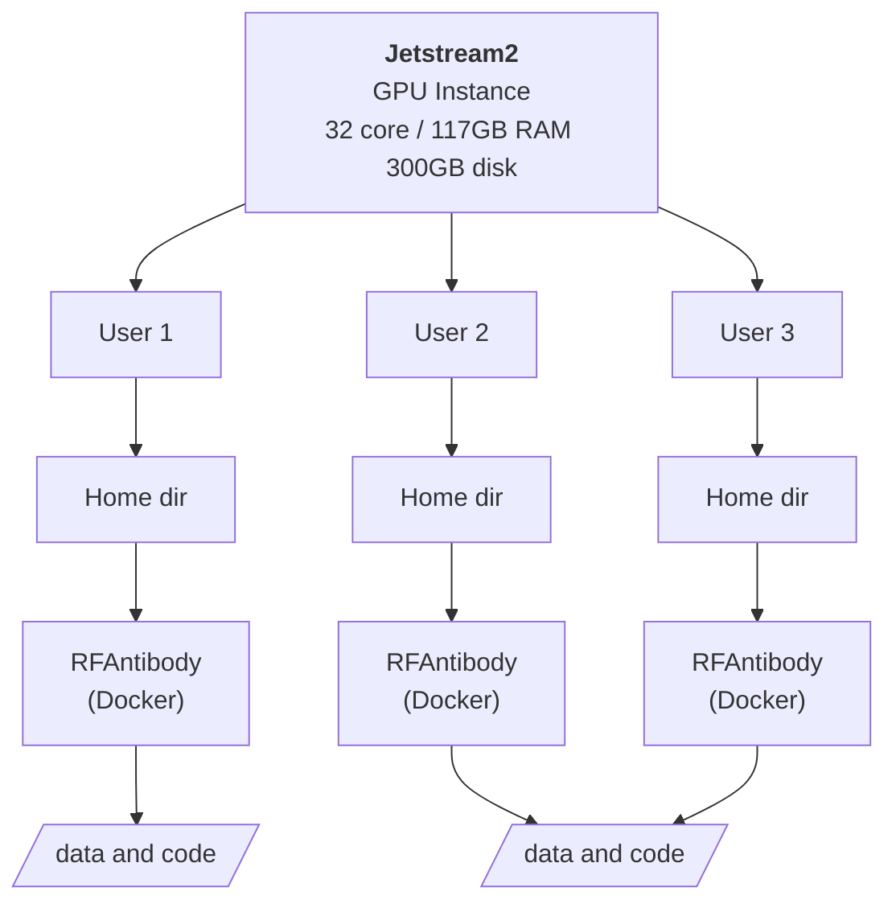

# 2025-Antibodies-and-AI
Updates and new projects in the Antibody Engineering Hackahons

## Compute Resources
**Architecture**

```mermaid
flowchart TD

A["<b>Jetstream2</b><br />GPU Instance<br />32 core / 117GB RAM 300GB disk"]
  --> B[User 1] --> C[Home dir] --> D["RFAntibody<br/>(Docker)"]
  --> E[/data and code/]
A --> B2[User 2] --> C2[Home dir] --> D2["RFAntibody<br/>(Docker)"] --> E2[/data and code/]
A --> B3[User 3] --> C3[Home dir] --> D3["RFAntibody<br/>(Docker)"] --> E2[/data and code/]

```

