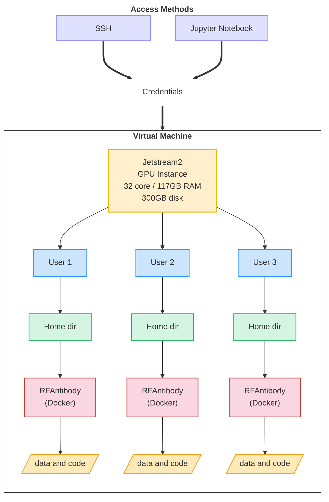

# 2025-Antibodies-and-AI
## Overview
### Goals
1. Select antibodies for modeling
2. Install and run RFAntibody
3. Evaluate designs
   
### Outcomes
1. Learn about antibody/antigen recognition (paratopes & epitopes)
2. Working with docker images and commands
3. Preparing data for RFAntibody
4. Analyzing protein structure designs
5. Learning about RFAntibody parameters specifically and AI issue in general

## Team Members
## Compute Resources
### General Architecture

Due to the nature of docker images/container and directories, each person running AI tests will have their own docker directory in their home directory. This way they can organize their files and scripts independently of others. Resources will be accessed through SSH and Jupyter Notebooks. Details regarding credentials and IP addressed will be posted to slack. 

### Installation
1. Follow the steps listed at [RFAntibody GitHub page](https://github.com/RosettaCommons/RFantibody)
2. Make additions/changes specified on [RFAntibody-notes](RFAntibody-notes.md#rfantibody-issues)
3. See [Docker](RFAntibody-notes.md#docker) for example commands.

