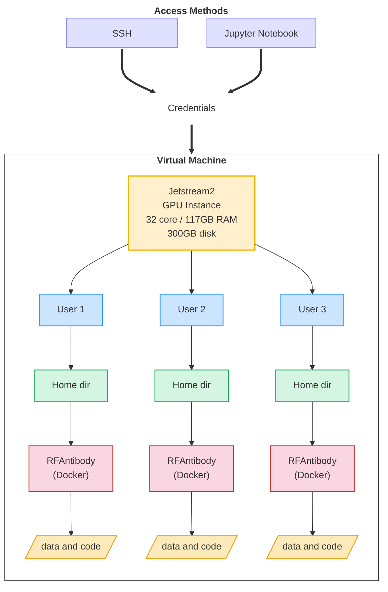

# 2025-Antibodies-and-AI
July, 2025

## Overview
### Goals
1. Learn aobut AI and different ways to use it
2. Select antibodies for modeling
3. Install and run RFAntibody and possible alternatives
4. Evaluate designs

See the [to do list](RFAntibody-ToDo.md) for specific items needed for evaluation.  
   
### Outcomes
1. Learn about antibody/antigen recognition (paratopes & epitopes)
2. Gain experience working with docker images and commands
3. Work with pdb files to prepare data for RFAntibody
4. Evaluate designs by analyzing generated protein sequences and structures
5. Develop an understanding of RFAntibody parameters specifically, data science used in evaluation, and AI issues in general

## Team Members
## Compute Resources
### General Architecture

Due to the nature of docker images/container and directories, each person running AI tests will have their own docker directory in their home directory. This way they can organize their files and scripts independently of others. Resources will be accessed through SSH and Jupyter Notebooks. Details regarding credentials and IP addressed will be posted to slack. 

### Installation
1. Read the [RFAntibody GitHub page](https://github.com/RosettaCommons/RFantibody) page. The steps and modications, closely follow this. 
2. Walk through the steps, including modifications, in [RFAntibody-notes](RFAntibody-notes.md#rfantibody-installation)
3. See [Docker](RFAntibody-notes.md#docker) for example docker commands.

