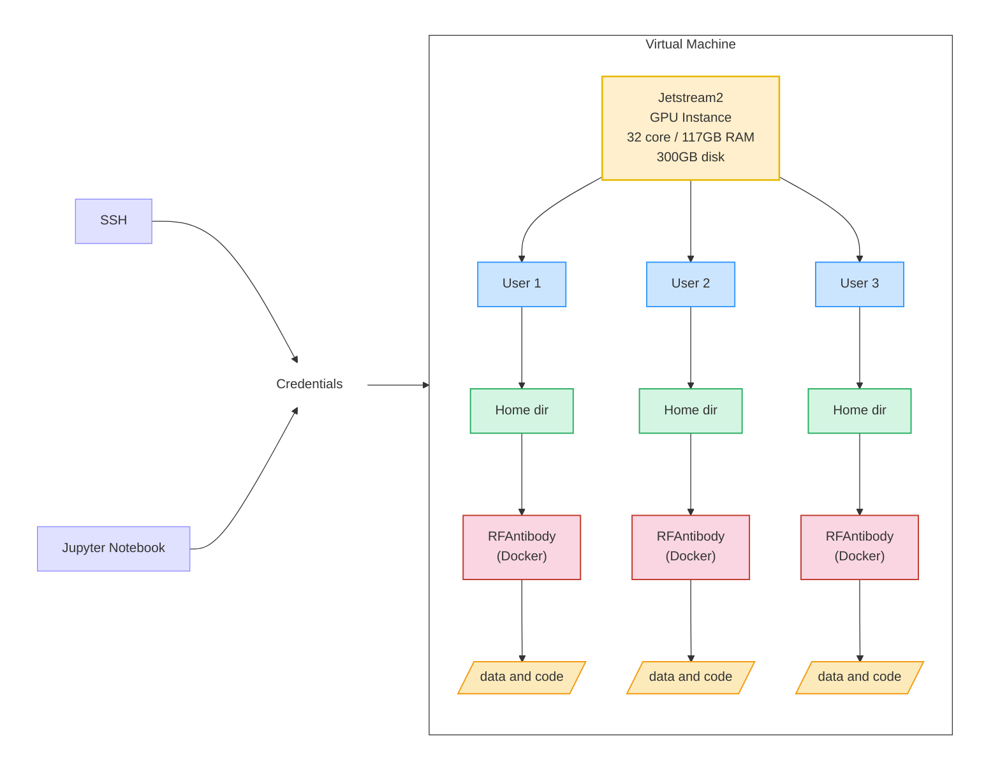

# 2025-Antibodies-and-AI
Updates and new projects in the Antibody Engineering Hackahons

## Compute Resources
### General Architecture

Due to the nature of docker images/container and directories, each person running AI tests will have their own docker directory in their home directory. This way they can organize their files and scripts independently of others. 

### Installation
1. Follow the steps listed at [RFAntibody GitHub page](https://github.com/RosettaCommons/RFantibody)
2. Make additions/changes specified on [RFAntibody-notes](RFAntibody-notes.md#rfantibody-issues)
3. See [Docker](RFAntibody-notes.md#docker) for example commands.

