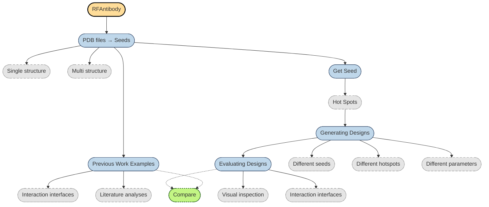

# RFAntibody To Do Ideas
July, 2025

## Overview
RFAntibody requires a seed structure to make designs. One made, which designs are the best? How do seeds, and other parameters affect designs? 



We have a collection of 23 PDF files containing nanobody/GFP or nanobody/RFP (other FP) structures and corresponding literature. Some most were obtained from an [OPIG search](https://opig.stats.ox.ac.uk/webapps/sabdab-sabpred/sabdab/search/?ABtype=All&method=All&species=All&resolution=&rfactor=&antigen=All&ltype=All&constantregion=All&affinity=All&isin_covabdab=All&isin_therasabdab=All&chothiapos=&restype=ALA&field_0=Antigens&keyword_0=green+fluorescent+protein). A couple of others were identified from the papers. 

The lists below provide examples of the work needed to address getting a seed structure and analyzing designs.  

## PDF files
- identify the unique structures
- within files
- between files
  
## Processing PDB Files
- clothia format to HLT format
- splitting the file into H (antibody) and T (target) files
- identifying the hotspots
- truncating T if necessary

 ## Running the analysis
 - prelim: Install and get the RFAntibody example to work
 - getting your molecule to work, organizing directories
 - modifying bash scripts, command lines
 - experimenting with parameters
 - testing with alternative examples, hot spots, truncations 

 ## Looking at designs
 - iCn3D
   * installing a local version, icn3D tools (node scripts, python scripts)
   * packaging data
     * collection files
     * json file
     * defining display options, color/space fill T, and color VHHs on (RDMS) scores  
 - open source pymol
   * installing
   * import scripts: color, style, central T and VHHs based on scores
   * aligning structures on the T chain for visualization
   * analyzing scores, replicate figures in the paper, but for different tests

## Create a collection file of the designs  
### Steps:  
- add the HEADER to each pdb file
  * HEADER \t title \t basename (basename must match ID in the JSON file)  
- put the files in a single directory  
- add a JSON file dirname.json
  * json example
    ```
    {
        "collectionTitle": "Antifreeze proteins",
        "collectionDescription": "Molecular structures of antifreeze proteins",
        "structures": [
          {
                "id": "1WFA.pdb",
                "title": "Winter Flounder Antifreeze protein",
                "description": "<p>An antifreeze protein from the Winter Flounder</p>",
                "commands": ["style proteins schematic", "color charge", "load mmdbaf1 1WFA"]
          },
          {
                "id": "3BOI.pdb",
                "title": "Snow Flea antifreeze protein",
                "description": "<p>An antifreeze protein from a snow flea</p>",
                "commands": ["load mmdbaf1 3BOI", "style proteins strand"]
          }
      ]
    }
  
- zip the directory -> dirname.zip
  * zip -r dir.zip dir
  * on a Mac > zip -r -X folder.zip folder
  * -X excludes the pesky Mac files
