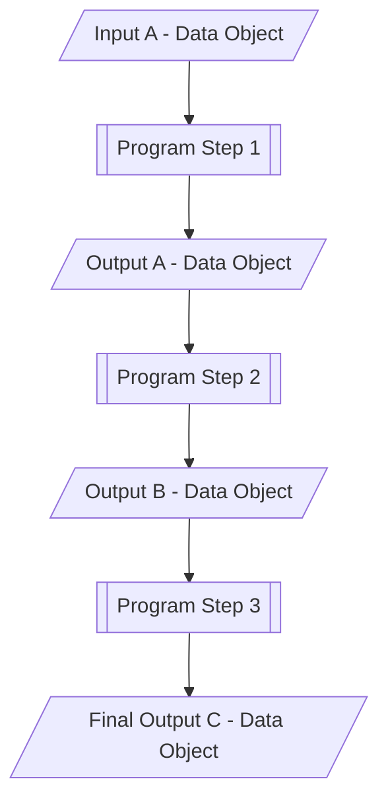

```mermaid
flowchart TD
    A[/Input A - Data Object/] --> P1[[Program Step 1]]
    P1 --> A_out[/Output A - Data Object/]

    A_out --> P2[[Program Step 2]]
    P2 --> B_out[/Output B - Data Object/]

    B_out --> P3[[Program Step 3]]
    P3 --> C_out[/Final Output C - Data Object/]
```
